<picture>
  <source media="(prefers-color-scheme: dark)" srcset="assets/header-dark.svg">
  
</picture>

I build the whole thing — the Go or TypeScript service, the UI in front of it, and the box it
runs on. Lately most of it has a model running locally rather than behind someone else's API,
and something checking the output before anyone is asked to trust it.

### Selected work

**[nebula-guard](https://github.com/Useless007/nebula-guard)** — SSH honeypot that streams Cowrie logs through a Go agent into a local Gemma model, writes the forensics to Postgres, and pushes a Thai-language read of the intrusion to Telegram. Next.js command center on top, GPU inference on my own machine. 
Go · Next.js · PostgreSQL · Ollama · Docker

**[content-blueprint](https://github.com/Useless007/content-blueprint)** — Windows desktop app for content teams. Calls the Claude Code or Codex CLI you are already signed into, re-validates every structured result in Go, and ships releases with published SHA-256 sums. Nothing posts or publishes on your behalf. 
Go · Wails · MCP · GitHub Actions

**[bun-rag-starter](https://github.com/Useless007/bun-rag-starter)** — Graph RAG over your own documents: Redis HNSW vectors and a Neo4j knowledge graph queried together, local embeddings, answers cached and fenced so the model stays inside the source material. 
Bun · Elysia · Neo4j · Redis · Svelte

**[THESIS_FASTAPI_YOLO](https://github.com/Useless007/THESIS_FASTAPI_YOLO)** — Thesis. An IoT parts store with role-gated staff workflows, plus a vision service that checks each package against its order before it ships and notifies the floor when the two disagree. 
Python · FastAPI · YOLO

**[btc-rainbow-worker](https://github.com/Useless007/btc-rainbow-worker)** — Cron'd Worker that computes the Bitcoin power-law band from the formula instead of scraping someone's chart, with three price sources behind a fallback chain. 
TypeScript · Cloudflare Workers · Bun

**[zig-typist](https://github.com/Useless007/zig-typist)** — Terminal typing trainer for Thai and English layouts. Sessions append to JSON Lines, so the history stays yours and stays greppable. 
Zig

### Tools I reach for

<picture>
  <source media="(prefers-color-scheme: dark)" srcset="assets/stack-dark.svg">
  
</picture>

 

<picture>
  <source media="(prefers-color-scheme: dark)" srcset="dist/github-contribution-grid-snake-dark.svg">
  
</picture>

ITI, KMUTNB — Bangkok. Off-hours: power-law charts, Kirby on the GBA, and a dog named Panda.

<!-- Banner and stack strip are generated locally: python3 assets/build_assets.py -->
